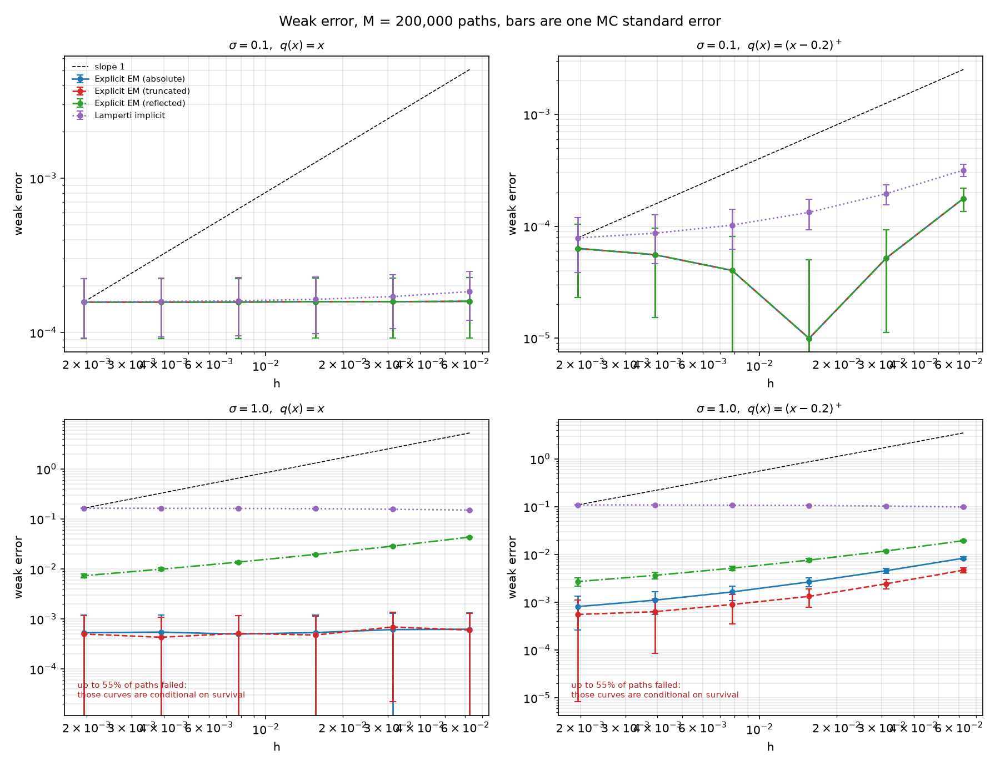
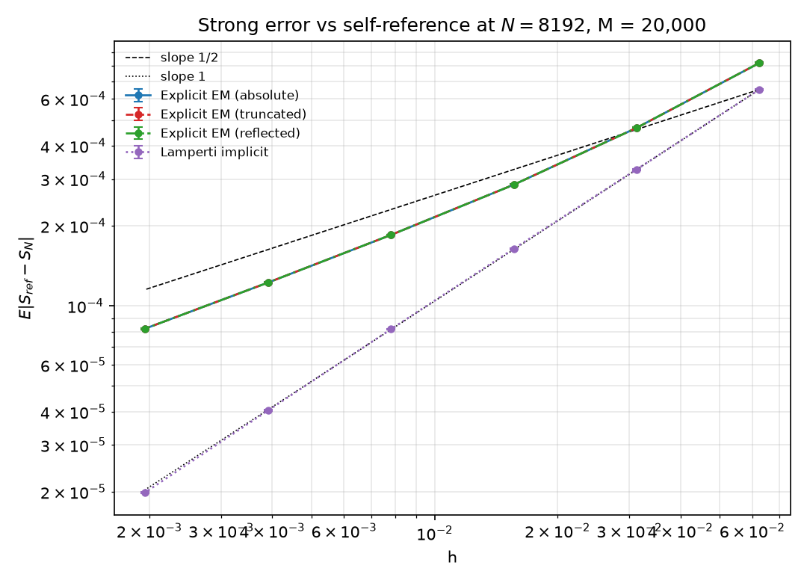
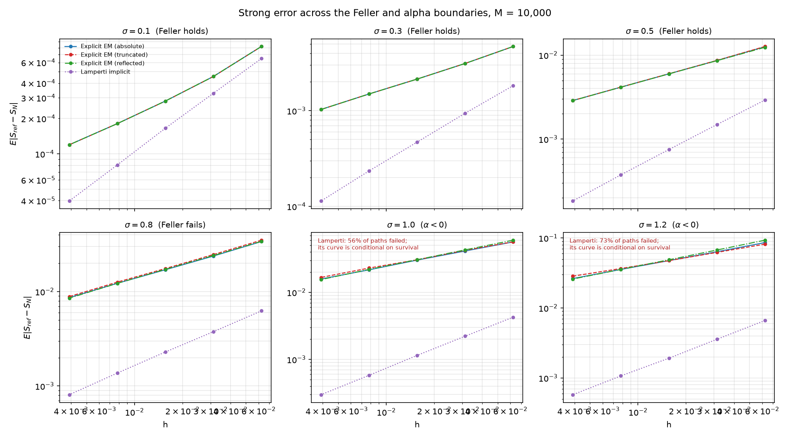
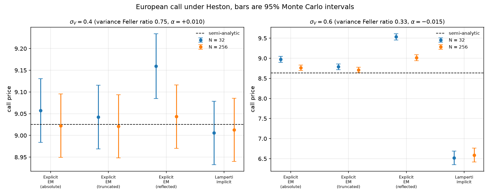

# Numerical Schemes for Square-Root Diffusions

Four discretisations of the Cox-Ingersoll-Ross process, compared on weak error, strong error, and the price of a European call under Heston. 
Everything is driven by one Brownian path per Monte Carlo sample, so schemes and mesh sizes are compared pairwise rather than as independent runs, 
and the weak error references are closed forms rather than Monte Carlo estimates.

## Background

The Cox-Ingersoll-Ross process

$$dS(t) = \kappa(\lambda - S(t)) dt + \sigma\sqrt{S(t)}dB(t), \qquad S(0) = S_0 > 0$$

has a diffusion coefficient that is not globally Lipschitz, so the standard convergence theory for Euler-Maruyama does not apply.
While the Feller condition, $2\kappa\lambda \geq \sigma^2$, holding means the true process will be positive almost surely,
naive discretisations can produce negative values under the square root regardless of the condition being met.
Feller not being met simply increases the rate at which the scheme may go negative.  

This is not merely academic. CIR is both a short-rate model and the variance process of the Heston model.
Heston parameters calibrated to equity index options routinely violate Feller by a wide margin, the variance parameters used in the pricing section below have Feller ratios of 0.75 and 0.33. 
What matters in practice is how each scheme behaves near zero at realistic stepsizes, not just its convergence order in the limit.

## Schemes compared

These four schemes were selected for comparison for three distinct reasons: 
the reflected scheme as a natural way of enforcing positivity by construction; 
the absolute and truncated schemes because they are known to converge strongly to the true CIR solution as $h \to 0$ 
(Dereich, Neuenkirch & Szpruch, 2012, and related work); 
and the Lamperti scheme because it is drift-implicit and attains strong order 1 under the Feller condition, making its behaviour once that condition fails particularly interesting.

Write $h$ for the stepsize and $\Delta B_{n+1}$ for the Brownian increment.

The Lamperti transform $Y = \sqrt{S}$ gives
$dY = (\alpha/Y + \beta Y)dt + \gamma dB$ with
$\alpha = (4\kappa\lambda - \sigma^2)/8$,  $\beta = -\kappa/2$, $\gamma = \sigma/2$.

| Scheme | Update | Non-negativity |
|---|---|---|
| Explicit EM (absolute) | $S_{n+1} = S_n + h\kappa(\lambda - S_n) + \sigma\sqrt{\lvert S_n\rvert} \Delta B_{n+1}$ | No, the state may go negative, but the diffusion then acts on $\lvert S_n\rvert$ |
| Explicit EM (truncated) | $S_{n+1} = S_n + h\kappa(\lambda - S_n) + \sigma\sqrt{\max(S_n,0)} \Delta B_{n+1}$ | No, the state may go negative, but the diffusion then switches off and only the drift $\kappa\lambda h$ acts |
| Explicit EM (reflected) | $S_{n+1} = \lvert S_n + h\kappa(\lambda - S_n) + \sigma\sqrt{S_n} \Delta B_{n+1}\rvert$ | Yes, by construction |
| Lamperti implicit | $Y_{n+1} = \dfrac{u}{2(1-\beta h)} + \sqrt{\dfrac{u^2}{4(1-\beta h)^2} + \dfrac{\alpha h}{1-\beta h}}$, $u = Y_n + \gamma\Delta B_{n+1}$ then $S_{n+1} = Y_{n+1}^2$ | Yes when $\alpha \geq 0$. Otherwise undefined as the radicand can go negative causing the scheme to return NaN |

The first three coincide exactly whenever a path stays positive, so any difference between them is a direct measurement of how often the discretised process crosses zero. 
Lamperti remains well defined whenever $\alpha \ge 0$ $(4\kappa \lambda \geq \sigma^2) $, a strictly weaker condition than Feller. 
Thus, in the range $2\kappa\lambda < \sigma^2 \le 4\kappa\lambda $, the Feller condition is not met and the true process can reach zero, yet the Lamperti scheme will not produce NaN. 

## Method

- The CIR transition density is a scaled noncentral $\chi^2$ distribution. This gives closed forms for the weak-error references $E[S(T)]$ and $E[(S(T)-K)^+]$.
  Both are exact, so there is no Monte Carlo noise on the reference side.

- Strong error is referenced to each scheme at $N_{\text{ref}} = 2^{13} =  8192$, sixteen times the finest tested level, on the same Brownian path.
  Tested levels are $N = 2^4,\dots,2^9$; the fit uses the four coarsest ($h = 1/16$ to $1/128$) and excludes $1/256$ and $1/512$,
  which are close enough to the reference mesh to bias the slope.
  
- All schemes and all resolutions are driven by the same Brownian path, obtained by summing blocks of fine increments.
  
- $M = 200{,}000$ paths for weak error, $20{,}000$ for strong error, $10{,}000$ per $\sigma$ in the sweep, $100{,}000$ for Heston.
  Monte Carlo standard errors are reported alongside every estimate,
  and the path loops accumulate running sums in batches so that the finest mesh never needs to be held in memory in full.

## Results

### Weak error

*The dashed "slope 1" is the rate a standard Euler-Maruyama scheme would attain under globally Lipschitz coefficients. 
The coefficients here are not globally Lipschitz, so the line is included only as a visual benchmark.*

At the baseline $\sigma = 0.1$, $q(x) = x$ no scheme has a resolvable weak error.
Every measurement sits within 2-8 standard errors of zero and is flat in $h$ (fitted slopes 0.00 to 0.40). 
For the absolute and truncated schemes this is exact, not just small.
$S_0 = \lambda$ is the fixed point of the mean recursion, so $E[S_n] =\lambda$ at every step-size, matching $E[S(t)] = \lambda$ exactly.
Reflected coincides with them here, since paths don't approach zero at this $\sigma$.
Lamperti's error is not exactly zero as it carries its own small bias from the transform but for $\sigma = 0.1$, it is too small to distinguish from the Monte Carlo noise.

For $\sigma = 0.1$, $q(x) = (x-0.2)^+$, the weak error is real and resolvable at the coarse end but shrinks sharply as $h$ decreases.
By the middle of the tested range it appears to have fallen to the size of the Monte Carlo noise floor. 

At $\sigma = 1$ the Feller condition fails and the behaviour changes. 
For $q(x) = x$, the absolute and truncated schemes' error remains exactly zero for the same reasons as it did before.
Reflection now injects mass at the boundary, showing a mean bias of $4.3\times10^{-2}$, 65 standard errors, decaying with fitted slope 0.51.
For $q(x) = (x-0.2)^+$, all three explicit schemes have non-zero weak error, 
with fitted weak orders 0.68 (absolute), 0.62 (truncated), 0.57 (reflected).

The Lamperti curves at $\sigma = 1.0$ are flat at around $1.5\times10^{-1}$ but should not be read as weak errors.
55% of paths fail, and the average is taken over the survivors, the paths that avoided the region close to zero where the scheme breaks.

### Strong Error

| Scheme | Fitted order | Error at $h=1/16$ | Error at $h=1/512$ |
|---|---|---|---|
| Explicit EM (absolute) | 0.716 | 8.20e-04 | 8.22e-05 |
| Explicit EM (truncated) | 0.716 | 8.20e-04 | 8.22e-05 |
| Explicit EM (reflected) | 0.716 | 8.20e-04 | 8.22e-05 |
| Lamperti implicit | 0.998 | 6.52e-04 | 1.99e-05 |

As expected, the three explicit schemes agree perfectly for $\sigma = 0.1$ . 
The Lamperti scheme attains the order 1 reported for drift-implicit Lamperti schemes in the literature.

The explicit figure of 0.716 sits above the classical 1/2 but should be read as a pre-asymptotic artefact.
At $\sigma = 0.1$, the diffusion coefficient varies so little over the range the process visits that the noise is close to additive, 
and the Milstein correction term that limits Euler-Maruyama to order 1/2 is small at these stepsizes. 
The sweep below shows the rate collapsing toward 1/2, and then below it, as $\sigma$ grows.

### Behaviour as the Feller condition fails

With $\kappa = 1$ and $\lambda = 0.2$ the two boundaries are at $\sigma = \sqrt{0.4} \approx 0.632$ (Feller) and $\sigma = \sqrt{0.8} \approx 0.894$ ($\alpha = 0$). 
Fitted strong orders across the sweep (a coarser reference mesh with fewer levels than the single-panel figure above, so the  fitted value of 0.724, differs slightly from the 0.716 reported above):

| $\sigma$ | Feller ratio | $\alpha$ | Explicit (abs / trunc / refl) | Lamperti | Lamperti failure rate |
|---|---|---|---|---|---|
| 0.1 | 40.00 | +0.0988 | 0.724 / 0.724 / 0.724 | 1.001 | 0 |
| 0.3 | 4.44 | +0.0888 | 0.549 / 0.549 / 0.549 | 0.988 | 0 |
| 0.5 | 1.60 | +0.0688 | 0.532 / 0.535 / 0.526 | 0.986 | 0 |
| 0.8 | 0.62 | +0.0200 | 0.489 / 0.492 / 0.492 | 0.728 | 0 |
| 1.0 | 0.40 | −0.0250 | 0.459 / 0.437 / 0.483 | 0.958\* | 0.545 |
| 1.2 | 0.28 | −0.0800 | 0.425 / 0.386 / 0.463 | 0.879\* | 0.734 |

\* conditional on survival, and therefore not comparable with the other rows.

The explicit schemes degrade smoothly as $\sigma$ increases. 
Settling near 1/2 as Feller is approached and 0.39-0.46 once it is violated. 
None of these fail however, by construction they deal with $S_N < 0$.
The Lamperti scheme holds order 1 right up to the Feller boundary, 
degrades to 0.73 at $\sigma = 0.8$ where Feller is already violated but $\alpha$ remains positive
and below $\alpha = 0$ a majority of paths fail, so its reported order there is significantly less meaningful.

### Effect on Heston option prices

European call, $S_0 = K = 100$, $r = 0.03$, $V_0 = \theta = 0.04$, $\kappa_V = 1.5$, $\rho = -0.5$, $T = 1$, $M = 100{,}000$ paths, 
against a semi-analytic benchmark obtained by Fourier inversion of the characteristic function (Heston, 1993; Albrecher, Mayer, Schoutens & Tistaert, 2007). 
Every scheme sees the same Brownian increments and the coarse mesh is a coarsening of the fine one, 
so differences between schemes and between meshes are paired.

At $\sigma_V = 0.4$ (Feller ratio 0.75, $\alpha = +0.010$, benchmark 9.0255)
the scheme choice is immaterial at $N = 256$, all four prices lie within 0.023 of the benchmark, well inside the ±0.073 Monte Carlo interval.

At $\sigma_V = 0.6$ (Feller ratio 0.33, $\alpha = -0.015$, benchmark 8.6316) it is not:

| Scheme | Price at $N=256$ | Bias vs benchmark | Paired diff. vs truncated | Failed paths |
|---|---|---|---|---|
| Explicit EM (absolute) | 8.7626 | +0.1310 | +0.0547 ± 0.0091 | 0 |
| Explicit EM (truncated) | 8.7079 | +0.0763 | - | 0 |
| Explicit EM (reflected) | 9.0144 | +0.3828 | +0.3065 ± 0.0129 | 0 |
| Lamperti implicit | 6.5893\* | −2.0423\* | −0.0299 ± 0.0118\* | 0.777 |

\* over surviving paths only.

The reflected scheme is biased high by 0.38, which is 4.4% of the option value and five times the 95% Monte Carlo half-width. 
The choice of variance scheme is worth more here than quadrupling the path count. 
The ranking is exactly what the mechanism predicts; reflection adds variance, and more variance raises an at-the-money call.

The paired coarse-minus-fine differences at $\sigma_V = 0.6$ show the same ordering in the discretisation bias itself: +0.5206 ± 0.0245 (reflected),
+0.2099 ± 0.0227 (absolute), +0.0815 ± 0.0263 (truncated). 
Truncation is the least mesh-sensitive of the three and the closest to the benchmark, 
and it is the one to use if a positivity-preserving variance scheme is wanted and $\alpha < 0$ rules out Lamperti.

## Limitations

- Strong error is measured against each scheme's own fine-mesh run, so what is reported is self-convergence,  not distance from the true solution.
  The pairwise agreement table is a partial check on this, not a substitute.
  
- Exact sampling gives the correct marginal density but does not use the same Brownian path as the schemes so it can only be used for weak error.
  
- Convergence orders are estimated from four or five levels spanning a factor of 8-16 in $h$.
  They are indicative, and results like the explicit schemes' 0.716 at $\sigma = 0.1$ is visibly pre-asymptotic.

- The spot process in the Heston section is discretised by log-Euler, which carries its own $O(h)$ bias.
  It is identical across schemes, so the comparison between schemes is unaffected,
  but the errors from the benchmark include it.
  
- Only one parameter family was used throughout ($\kappa = 1$, $\lambda = S_0 = 0.2$), and
  no calibration to market data. The Heston parameters are plausible but invented.
  
- Every Lamperti figure in the $\alpha < 0$ regime is conditional on survival and is addressed each time it is relevant.
  

## References

